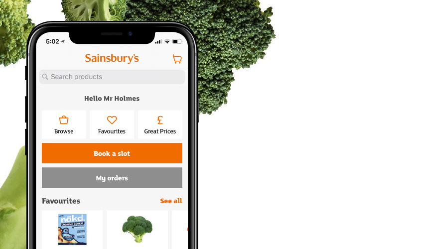

# Text Analytics of Sainsbury Application Review

## Dataset
The dataset can be accessed in Dataset folder. It consists a CSV file as `sainsbury_data_6_november_2022_FINAL_PYTHON.csv`.

You can find the scrap your dataset using the code as follows:
```
from google_play_scraper import Sort, reviews_all

mobile_apps_review = reviews_all('com.sainsburys.gol', sleep_milliseconds=0, lang='en', country='us', sort=Sort.NEWEST)
```



## Package
Please ensure that you have import important packages as follows:
```
# General Packages
from google_play_scraper import app
import pandas as pd
import numpy as np
import seaborn as sns
import nltk
import numpy
import string
import matplotlib.pyplot as plt
from nltk.tokenize import word_tokenize
import datetime as dt

# Vader - Sentiment Analysis
!pip install vaderSentiment -q
nltk.download('vader_lexicon', quiet=True)
from nltk.sentiment.vader import SentimentIntensityAnalyzer
from tqdm.notebook import tqdm

# Topic Modeling - LDA
!pip install -U pip setuptools wheel -q
!pip install -U spacy -q # or pip3
!python -m spacy download en_core_web_sm -q # or python3
import spacy
```

## Step 1: Data Cleaning
The objective of data cleansing is the elimination of redundant or superfluous words. This can be achieved by utilizing the nltk.corpus library to filter out predefined stop words. Additionally, you have the flexibility to append custom terms for removal using the variable some_more_tokens_to_remove.

## Step 2: Part of Speech (POS) Tagging

This procedure is designed to ascertain the lexical categorization of words as either nouns or adjectives. Such categorization enhances the interpretability of the data, particularly when aiming to conduct a targeted analysis of specific information.

## Step 3: World Cloud Analysis
Utilizing meticulously curated and categorized data, the initial step involves conducting a word cloud analysis. This analytical approach facilitates a comprehensive understanding of the predominant terms within the dataset.

## Step 4: Sentiment Analysis - VADER
Sentiment analysis serves the purpose of categorizing words within a given context as either conveying a positive or negative sentiment. This analytical approach aids in gaining insights into the overall reception of an application, beyond just numerical ratings. Furthermore, when integrated with time series analysis, it enables the examination of sentiment trends over time, specifically in relation to different application versions.

## Step 5: Topic Modelling - Latent Dirichlet Allocation
Topic modeling, as employed in the Latent Dirichlet Allocation (LDA) algorithm, serves the purpose of organizing a collection of words into distinct thematic categories. In contrast to word cloud analysis, which focuses on individual words, LDA categorizes words into topics, providing a more contextual and structured understanding of the underlying content.

## Step 6: Tri-gram analysis
Tri-gram analysis represents a supplementary method for grasping topics by considering sequences of three words. It constructs meaningful phrases or combinations of words composed of three elements to uncover the most significant insights within the text.
